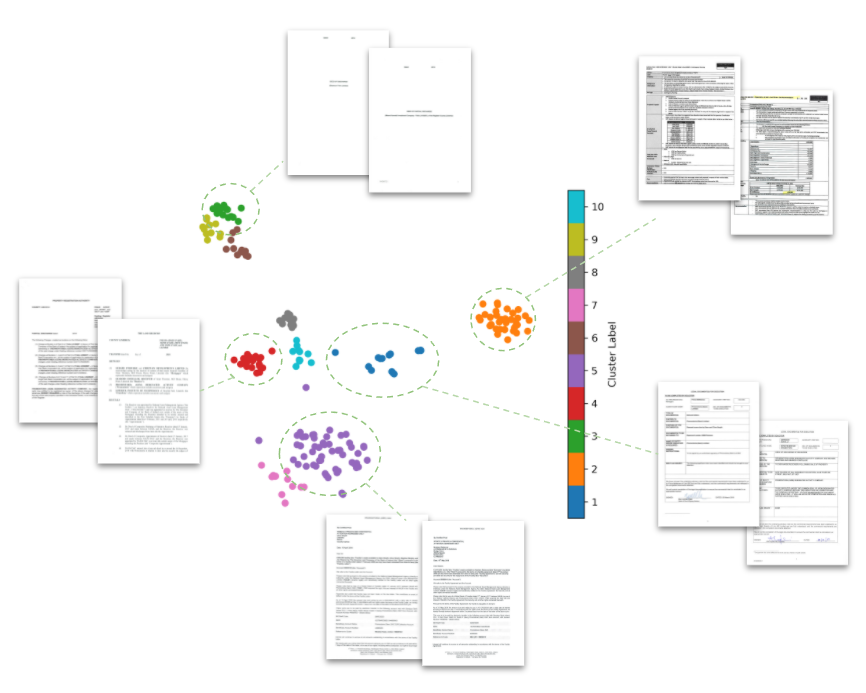

# Cerberus Document Clustering


## Purpose

The purpose of this project is to implement a state-of-the-art deep learning model (LayoutLMv2) to automatically generate cluster labels for unseen documents from each project at Cerberus.

<p align="center"></p>
<p align="center">Example document clustering results and sample documents within each cluster</p>

The proof-of-principle pipeline contains a Jupyter
`notebooks/document_clustering.ipynb` that contains code for data preprocessing and clustering. The notebook was developed and tested on Azure ML environment.

## Table of Contents

1. [Installation](#1-Installation)
1. [Usage](#2-Usage)
1. [Output Format](#3-Output-Format)
1. [Deployment on Azure](azure/README.md)

## Installation

The user needs to install the required packages to run the code on Azure Machine Learning studio. The packages are specified in `install.sh` and can be installed by running the following command in the terminal window. For further installation details, please refer to the next section.

```
./install.sh
```

## Usage

1. Open your workspace in Azure Machine Learning studio.
2. On the left side, select Compute and add a new instance with GPU, preferably the `STANDARD_NC6S_V3` instance.
3. On the left side, select Notebooks.
4. On the top toolbar, select `Python 3` kernel.
5. Select the Open terminal image on the top of the notebook
6. clone repo by running `git clone https://github.com/SFLScientific/Cerberus_Document_Classification.git && cd "$(basename "$_" .git)"`
7. Install packages by running `./install.sh` in the terminal.
8. Example of usage of the repo is given under `notebooks/document_clustering.ipynb`

Prior to running the notebook, there is a config file (`config/doc_cls_config.yaml`) where users are able to define the input, output, and the hyperparameters for the model. The input, the path to the dataroom, and the output, the location of the `JSON` output file can be set in the config file. For all other parameters in the config file, it is recommended that the users use the default values.

The config file has a parameter `user_define_k` under the kmeans parameters section. When defined at 0 by default, the elbow method will be used. Otherwise, the non-zero integer defined by the user will be adopted as the number of clusters adopted during the pdf/doc-clustering.

The current processing time for 100 documents is around 6 minutes.

Several parameters can be configured in `config/doc_cls_config.yaml.

- `encoding_limit`: Limit encoded sentences to a specified fixed length
- `batch_size`: batch size for LayoutLM inference.
- `top_n_keywords`: Number of keywords to be extracted from a document
- `keyphrase_ngram_range`: Range of length of each key phrase.
- `user_define_k`: Number of clusters defined by user.
- `max_tries`: Maximum iterations for performing elbow method.
- `num_processor`: Number of multiprocessing cores.

## Output Format

The format of the output `JSON` file includes `document path`, `cluster label`, `cluster description`, and `confidence score` for all documents in a dataroom.

### Contacts

    - Developers
        - Andrew Tseng (atseng@sflscientific.com)
        - Tania Kong (tkong@sflscientific.com)
    - SFL Scientific founders
        - Mike Luk (mluk@sflscientific.com)
        - Mike Segala (msegala@sflscientific.com)
        - Dan Ferrante (danieldf@sflscientific.com)
