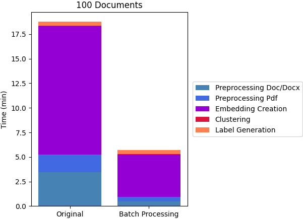
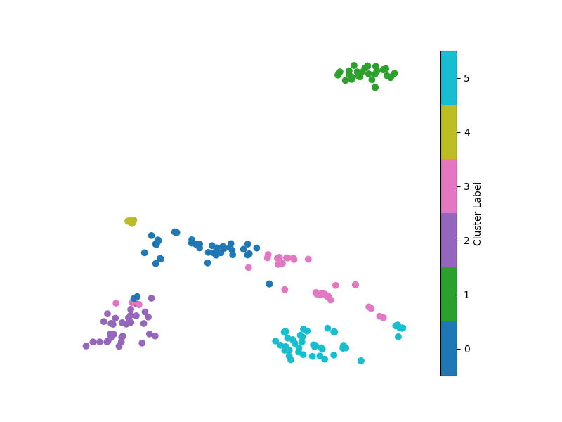
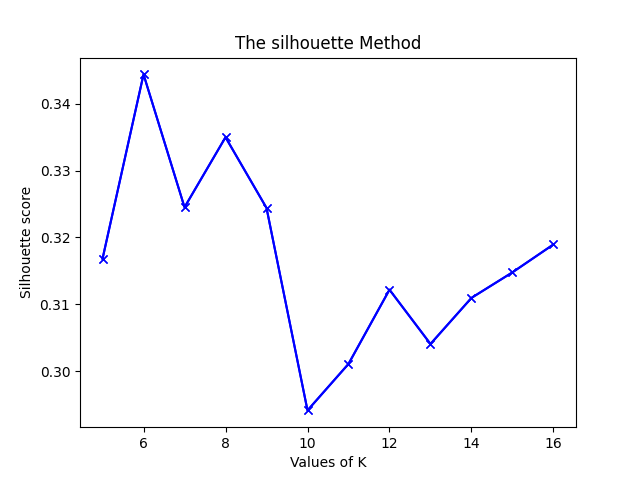

# Document Clustering with LayoutLMv2

This notebook provides code for document classification on Cerberus documents from a sample data room.

The pipeline has been tested on an Azure ML notebook with a `Python 3` kernel, using a `STANDARD_NC6S_V3` as the compute instance.

Based on document type, documents are clustered in different ways. PDF/DOC(X), and RTF formats will undergo the recommended modeling process (LayoutLMv2, KMeans, KeyBERT). The remaining document types will be clustered and labeled based on format type.

<p align="center"></p>

This version provides batch processing of documents which significantly increases the efficiency of the model compared with the previous version. A benchmark is shown in the following figure.

<p align="center"></p>


### Install Dependencies
The document clustering model is composed of three models, 1) LayoutLMv2 document feature extraction model, 2) KeyBERT keyword extraction model, and 3) KMeans clustering model. The required dependencies can be installed by running `./install.sh` in the terminal. One can open a terminal window by clicking the terminal icon on the left of the notebook toolbar on the top.

## Importing Libraries


```python


# general functions
import os
import sys
import glob
import pickle
import time
import logging
import yaml
import argparse
import shutil
from ast import literal_eval
import pandas as pd
import numpy as np
from collections import defaultdict
import multiprocessing
from multiprocessing import Pool 

# modeling functions
import torch
from pdf2image import convert_from_path

from transformers import (LayoutLMv2FeatureExtractor, 
    LayoutLMv2Tokenizer, 
    LayoutLMv2Processor, 
    LayoutLMv2ForSequenceClassification
)

from transformers import logging as transformer_logger
transformer_logger.set_verbosity_error()
os.environ["SFL_SCIENTIFIC_CODE_REPO"] = os.path.dirname(os.getcwd())
PROJECT_ROOT = os.environ["SFL_SCIENTIFIC_CODE_REPO"]
sys.path.insert(0, PROJECT_ROOT)

from src.model import (assign_discriptions,
                   batch_inference,
                   cluster_kmeans_elbow,
                   pdf2keywords_keybert,    
                   process_png            
)

from src.preprocess import (doc_to_pdf_multi,
                   get_type_path_dict,
                   get_failed_pdf,
                   multi_process_pdf_to_img               
)

from src.utils import make_tmp_dir


```

## Defining Model Inputs
A config file `notebook_config.yaml` contains all input parameters for the model, such as the path to the root of the data room `data_room_root_path` and the user-defined number of clusters `user_define_k`.

For further details on how to choose the number of clusters, one can refer to the clustering section in this notebook. All other default hyperparameters are specified in the config file. 


```python
# general settings
pd.set_option('max_colwidth', -1)
np.random.seed(3)
TIMESTR = time.strftime("%Y%m%d-%H%M%S")
CONFIGPATH = "../config/doc_cls_config.yaml"
LOGPATH = f"{TIMESTR}.log"
os.environ["TOKENIZERS_PARALLELISM"] = "false"
# open config file and load
with open(CONFIGPATH, "r") as f:
    config = yaml.load(f,Loader=yaml.Loader)

# load config info
DATAROOM_ROOT_PATH = config['inputs']['data_room_root_path']
DOC_TMP_FOLDER = config['storage']['unprocessed_doc_dir']
TRANSFROMED_PDF_FOLDER =config['storage']['processed_dir']
TOP_N_KEYWORDS = config['keyword_extraction']['top_n_keywords']
KEYPHRASE_NGRAM_RANGE = config['keyword_extraction']['keyphrase_ngram_range']
ENCODING_LIMIT = config['layoutlm_model']['encoding_limit']
BATCH_SIZE = config['layoutlm_model']['batch_size']
FIXK = config['kmeans_model']['user_define_k']
MAX_TRIES = config['kmeans_model']['max_tries']
NUM_PROCESSOR = config['multi_process']['num_processor']
OUTPUT_PATH = config['outputs']['json_path']

# remove intermediate folders from previous runs
if os.path.exists(DOC_TMP_FOLDER):
    shutil.rmtree(DOC_TMP_FOLDER)

if os.path.exists(TRANSFROMED_PDF_FOLDER):
    shutil.rmtree(TRANSFROMED_PDF_FOLDER)

os.makedirs(TRANSFROMED_PDF_FOLDER)
logging.basicConfig(filename=LOGPATH,level=logging.INFO,format= '[%(asctime)s] %(levelname)s - %(message)s',datefmt='%H:%M:%S')
```

## Process Doc(x) and RTF Files
Doc(x) and RTF files will be converted to pdf format for further processing.


```python
# Get document type information
doc_type_dict = get_type_path_dict(DATAROOM_ROOT_PATH)
existing_doc_types = list(doc_type_dict.keys())

doc_docx_rtf_path_list=[]
for doc_type in ['doc','docx','rtf']:
    if doc_type in existing_doc_types:
        doc_docx_rtf_path_list.extend(doc_type_dict[f"{doc_type}"])

pdf_path_list=[]
for doc_type in ['pdf']:
    if doc_type in existing_doc_types:
        pdf_path_list.extend(doc_type_dict[f"{doc_type}"])

png_path_list=[]
for doc_type in ['png']:
    if doc_type in existing_doc_types:
        png_path_list.extend(doc_type_dict[f"{doc_type}"])

# Process doc(x)/rtf files in dataroom
if not len(doc_docx_rtf_path_list)==0:

    st = time.time()
    # Save docs, doc, rtf to seperate temporary folders and keep track of them
    new_doc_path_list = make_tmp_dir(doc_docx_rtf_path_list, DOC_TMP_FOLDER)

    # Libreoffice has a limit of 200 documents when multiprocessing, thus process each folder with 200 one by one
    for subfolder in glob.glob(os.path.join(DOC_TMP_FOLDER,"*/")):
        if not len(glob.glob(os.path.join(subfolder,"*.doc")))==0:
            doc_tmp_folder = os.path.join(subfolder,"*.doc")
            doc_to_pdf_multi(doc_tmp_folder,TRANSFROMED_PDF_FOLDER)
        if not len(glob.glob(os.path.join(subfolder,"*.docx")))==0:
            doc_tmp_folder = os.path.join(subfolder,"*.docx")
            doc_to_pdf_multi(doc_tmp_folder,TRANSFROMED_PDF_FOLDER)
        if not len(glob.glob(os.path.join(subfolder,"*.rtf")))==0:
            doc_tmp_folder = os.path.join(subfolder,"*.rtf")
            doc_to_pdf_multi(doc_tmp_folder,TRANSFROMED_PDF_FOLDER)
    
    end = time.time()
    logging.info(f"doc(x)/rtf to pdf format, spent: {end-st}s")

    # Get transformed pdf path list for further processing
    transformed_pdf_file_list = glob.glob(os.path.join(TRANSFROMED_PDF_FOLDER , f"**/*.pdf"), recursive=True)

    # Format dataframe for storing results for doc, docx, rtf
    final_output = pd.DataFrame(doc_docx_rtf_path_list, columns =['document_path'], dtype = str)
    final_output["corrupt"]=0

    # Keep track of corrupted docs
    failed_document_id = get_failed_pdf(new_doc_path_list, transformed_pdf_file_list)
    final_output.iloc[failed_document_id, final_output.columns.get_loc('corrupt')] = 1

    tmp_doc_pdf_list = []
    pdf_id=0
    for i in range(len(doc_docx_rtf_path_list)):
        if i in failed_document_id:
            tmp_doc_pdf_list.append("None")
        else:
            tmp_doc_pdf_list.append(transformed_pdf_file_list[pdf_id])
            pdf_id+=1

    final_output["pdf_path"]=tmp_doc_pdf_list

else:
    # Create empty dataframe
    final_output= pd.DataFrame([], columns =['document_path','pdf_path', 'corrupt'], dtype = str)


if not len(pdf_path_list)==0:
    # Append original pdf list to existing dataframe
    pdf_output = pd.DataFrame(pdf_path_list, columns =['document_path'], dtype = str)
    pdf_output['corrupt']=0
    pdf_output["pdf_path"]=pdf_path_list
    final_output = pd.concat([final_output, pdf_output], axis=0).reset_index(drop=True)

    df_uncorrupted_documents = final_output[final_output['corrupt']==0]
    df_corrupted_documents = final_output[final_output['corrupt']==1]
    final_output = pd.concat([df_uncorrupted_documents, df_corrupted_documents], axis=0).reset_index(drop=True)

else:
    # Create empty dataframe
    df_uncorrupted_documents = final_output[final_output['corrupt']==0]
    df_corrupted_documents = final_output[final_output['corrupt']==1]
    final_output = pd.concat([df_uncorrupted_documents, df_corrupted_documents], axis=0).reset_index(drop=True)


```

## Process PDF Files

PDFs in the data room and the DOC(X) and RTF files that are converted to PDFs, will be further converted to images for further processing.


```python
# Process all non corrupted pdfs
if not len(final_output[final_output['corrupt']==0])==0:
    st = time.time()
    pdf_embeddings=[]
    blank_check=[]
    corrupted_pdf_id_list=[]
    remaining_pdf_list = final_output[final_output["corrupt"]==0]["pdf_path"].tolist()
    pdf_to_pil_batch_sz = 100
    for i in range(len(remaining_pdf_list)//pdf_to_pil_batch_sz+1):
        # pdf to pil format
        pdf_file_list = remaining_pdf_list[i*pdf_to_pil_batch_sz:(i+1)*pdf_to_pil_batch_sz]
        image_c_list = multi_process_pdf_to_img(pdf_file_list, NUM_PROCESSOR)
        corrupted_pdf_ids = [c for pil_image,c in image_c_list]
        pil_image_list = [pil_image for pil_image,c in image_c_list]

        #LayoutLM
        device = torch.device("cuda" if torch.cuda.is_available() else "cpu")
        sub_pdf_embeddings, sub_blank_check = batch_inference(pil_image_list, BATCH_SIZE, device, int(ENCODING_LIMIT))
        pdf_embeddings.append(sub_pdf_embeddings)
        # corrupted_pdf_id_list.append(corrupted_pdf_ids)
        corrupted_pdf_id_list.extend(corrupted_pdf_ids)
        blank_check.extend(list(sub_blank_check))

        del image_c_list
        del pil_image_list

        
    # Keep track of corrupted pdfs
    blank_pdf_check_list = [int(bc==102) for bc in blank_check]
    corrupted_pdf_list = corrupted_pdf_id_list
    corrupted_blank_pdf_list=[a or b for a,b in zip(corrupted_pdf_id_list,blank_pdf_check_list)]

    end = time.time()
    logging.info(f"pdf to PIL format, spent: {end-st}s")
    
else:
    # if no pdf files in dataroom, create empty list as placeholder
    corrupted_pdf_list = []
    blank_pdf_check_list = []
    corrupted_blank_pdf_list = []
    pdf_embeddings = []


```

## Process PNG Files


```python
if not len(png_path_list)==0:
    device = torch.device("cuda" if torch.cuda.is_available() else "cpu")
    png_embeddings, blank_check_png_list = process_png(png_path_list,  BATCH_SIZE, device, int(ENCODING_LIMIT))
    # Append png information to dataframe
    png_output = pd.DataFrame(png_path_list, columns =['document_path'], dtype = str)
    png_output["corrupt"]=0
    png_output["pdf_path"]="image_file"
    final_output = pd.concat([final_output, png_output], axis=0).reset_index(drop=True)

else:
    # if no png files in dataroom, create empty list as placeholder
    blank_check_png_list=[]
    png_embeddings = []

# Update final output with pdf and png information
number_of_corrupted_doc_xdocx_rtf = len(final_output) - len(corrupted_pdf_list) - len(blank_check_png_list)
final_output["corrupted_pdf"] = corrupted_pdf_list + [1]*(number_of_corrupted_doc_xdocx_rtf) + blank_check_png_list
final_output["no_content"] = blank_pdf_check_list + [1]*(number_of_corrupted_doc_xdocx_rtf) + blank_check_png_list

df_blank_documents = final_output[(final_output["corrupted_pdf"]==0) & (final_output["no_content"]==1)]
df_corrupted_documents = final_output[(final_output["corrupted_pdf"]==1)]
df_uncorrupted_not_blank =  final_output[(final_output["no_content"]==0) & (final_output["no_content"]==0)]
final_output = pd.concat([df_uncorrupted_not_blank,df_blank_documents, df_corrupted_documents], axis=0)
final_output = final_output.reset_index(drop=True)


```

# Document Clustering
## Kmeans on document embeddings


KMeans is used to cluster embedded documents into groups where the TSNE model is used to visualize the clustering results.

When the user does not specify the number of clusters for the documents, leaving `user_define_k` as `0` in the config file, The Elbow Method will be used to determine the optimal number of clusters.

Confidence scores for each data point are calculated here as well using the Silhouette Coefficient and normalized to 0-1.


<table><tr>
<td>Example of Clustering</td>
<td>  </td>
<td>Example of Elbow Method</td>
<td>  </td>
</tr></table>


```python
if not len(df_uncorrupted_not_blank) == 0:

    st = time.time()
    # Format embeddgings to dataframe
    document_embeddings = np.expand_dims(np.vstack(pdf_embeddings+png_embeddings), axis=1).tolist()
    document_embeddings_df = pd.DataFrame(document_embeddings, columns=["token0v2"])
    document_embeddings_df["corrupt"] = corrupted_blank_pdf_list + blank_check_png_list
    un_corrupted_embeddings = document_embeddings_df[document_embeddings_df["corrupt"]==0].reset_index(drop=True)

    # Kmeans with Elbow method
    cluster_label_list, confidence_score_list, closest_to_centroid = cluster_kmeans_elbow(un_corrupted_embeddings, user_define_k = FIXK, max_tries = MAX_TRIES, show_tsne=True)
    end = time.time()
    logging.info(f"Clustering, spent: {end-st}s")


    # update cluster ID and confidence score to final output
    cluster_label_col = cluster_label_list + ["no_content"]*len(df_blank_documents) + ["corrupt"]*len(df_corrupted_documents)

    confidence_score_col = confidence_score_list + [0]*(len(final_output)-len(cluster_label_list))
    final_output["cluster_label"] = cluster_label_col
    final_output["confidence_score"] = confidence_score_col
    
else:
    final_output["cluster_label"] = "corrupt"
    final_output["confidence_score"] = 0

```

# Document Description Generation

KeyBERT is used to extract keywords from centroid documents. These keywords are then used as the descriptions of the clusters.


```python
if not len(df_uncorrupted_not_blank) == 0:
    st = time.time()
    # Load OCR
    feature_extractor = LayoutLMv2FeatureExtractor()
    tokenizer = LayoutLMv2Tokenizer.from_pretrained("microsoft/layoutlmv2-base-uncased")
    processor = LayoutLMv2Processor(feature_extractor, tokenizer)
    
    # Keyword generation
    centroid_discription_paths = final_output.iloc[closest_to_centroid]["pdf_path"]
    centroid_discriptions  = centroid_discription_paths.apply(pdf2keywords_keybert, 
                                                            processor=processor, 
                                                            keyphrase_ngram_range = literal_eval(KEYPHRASE_NGRAM_RANGE), 
                                                            top_n = TOP_N_KEYWORDS)
    end = time.time()
    logging.info(f"Keyword extraction, spent: {end-st}s")

    # Add label discription to final output
    final_output['label_description'] = final_output.apply(lambda x: assign_discriptions(x['cluster_label'],centroid_discriptions), axis=1)
    final_output.drop(columns=['corrupt', 'no_content', 'pdf_path', 'corrupted_pdf'], axis = 1, inplace = True)

else:
    # If all doc(x)/rtf/png/pdf are corrupted or no doc(x)/rtf/png/pdf
    # in the dataroom, then generate an empty dataframe output
    final_output['label_description'] = "corrupt"
    final_output.drop(columns=['corrupt', 'no_content', 'pdf_path', 'corrupted_pdf'], axis = 1, inplace = True)


```

# Final JSON Output

As the cluster labels, descriptions, and the confidence scores for PDF/DOC(X)/RTF files are obtained, these results are merged with the clustering results of the other document types.

As shown in the workflow diagram at the beginning of the notebook, document types like .db, .xslx, zip,... will not go through the general process. They are grouped only by their file extensions, so the confidence score will be 1 for these file types.


```python
# Merge informaton of other data types into final output
other_type_path_list = []

for doc_type, doc_path_list in doc_type_dict.items():
    if doc_type not in ["pdf","doc","docx","rtf","png"]:
        for doc_path in doc_path_list:
            other_type_path_list.append([doc_path, doc_type ,"1", doc_type])

other_type_df = pd.DataFrame(other_type_path_list, columns=['document_path', 'cluster_label', 'confidence_score', 'label_description'])
final_output = pd.concat([final_output, other_type_df], axis=0).reset_index(drop=True)

final_output.to_json(OUTPUT_PATH, orient='records', lines=True)

# Remove intermediate files
if os.path.exists(DOC_TMP_FOLDER):
    shutil.rmtree(DOC_TMP_FOLDER)

if os.path.exists(TRANSFROMED_PDF_FOLDER):
    shutil.rmtree(TRANSFROMED_PDF_FOLDER)


```
